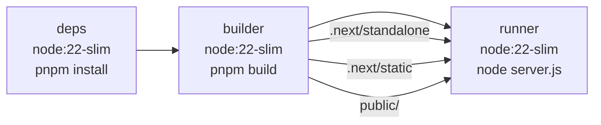
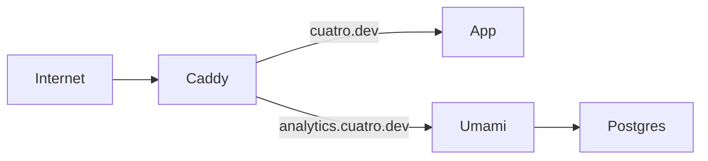
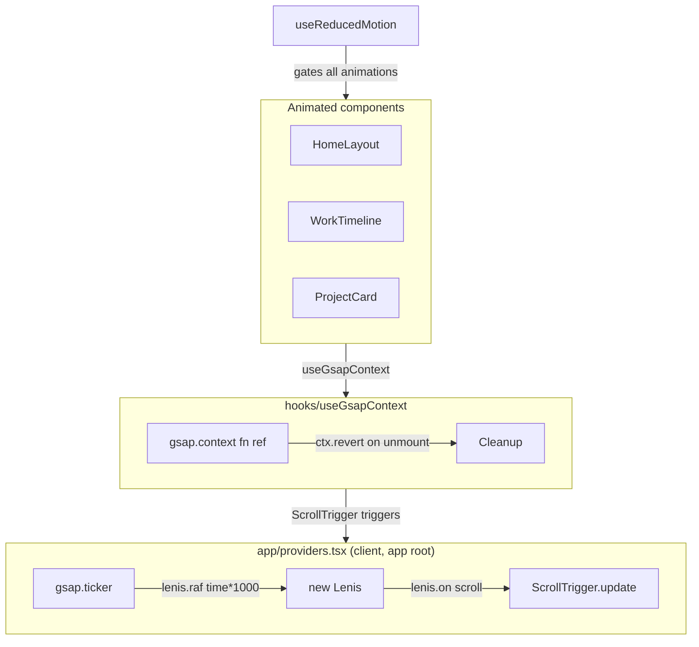

# Cuatro Porfolio

My Personal portfolio, deployed at [cuatro.dev](https://cuatro.dev). High-quality visuals, 3D interactive scenes, and scroll-driven storytelling. Fully self-hostable via Docker Compose.

## Tech Stack

| Layer         | Technology                                                |
| ------------- | --------------------------------------------------------- |
| Framework     | Next.js 16 (App Router, standalone output)                |
| UI            | React 19                                                  |
| Language      | TypeScript 5.9                                            |
| 3D / WebGL    | Three.js 0.183 + React Three Fiber v9 + @react-three/drei |
| Post FX       | @react-three/postprocessing (Bloom, chromatic aberration) |
| Animations    | GSAP 3.14 + ScrollTrigger                                 |
| Smooth Scroll | lenis                                                     |
| Styles        | Sass 1.97 (SCSS)                                          |
| Analytics     | Unami (self-hosted)                                       |
| Reverse Proxy | Caddy (auto-HTTPS)                                        |
| Testing       | Vitest + Playwright                                       |

## Local Development

```bash
pnpm install
pnpm dev        # http://localhost:3000
pnpm typecheck
pnpm build
```

## Docker

```bash
docker compose up --build
```

Opens at <http://localhost:3000>. Three-stage build: deps -> builder -> runner (Node 22-slim)



## One-command deploy

```bash
docker compose --env-file .env.production up --build -d
```



## Environment Varialbes

Copy `.env.example` and fill in values. Variables prefixed `NEXT_PUBLIC_` are inlined at build time.

| Variables                    | Description                    | Required |
| ---------------------------- | ------------------------------ | -------- |
| NEXT_PUBLIC_UMAMI_WEBSITE_ID | Umami site ID                  |          |
| NEXT_PUBLIC_UMAMI_URL        | <https://analytics.cuatro.dev> |          |

## Routing

| Route             | Description                                      |
| ----------------- | ------------------------------------------------ |
| `/`               | Home - GSAP layout + 3D gem                      |
| `/work`           | Experience Timeline                              |
| `/projects`       | Case studies grid                                |
| `/cv`             | Redirect to `public/pdf/cv.pdf`                  |
| `/recommendation` | Redirect to `public/pdf/remmendation-letter.pdf` |

## Animation Architecture

Lenis owns the scroll position. GSAP owns the animation timeline. ScrollTrigger bridges them.


