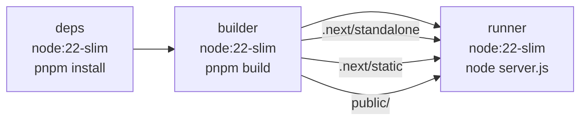
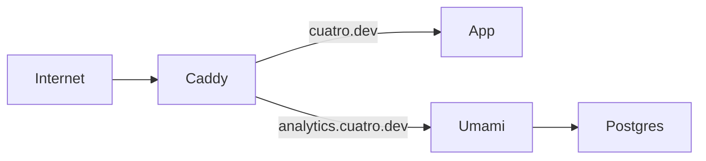
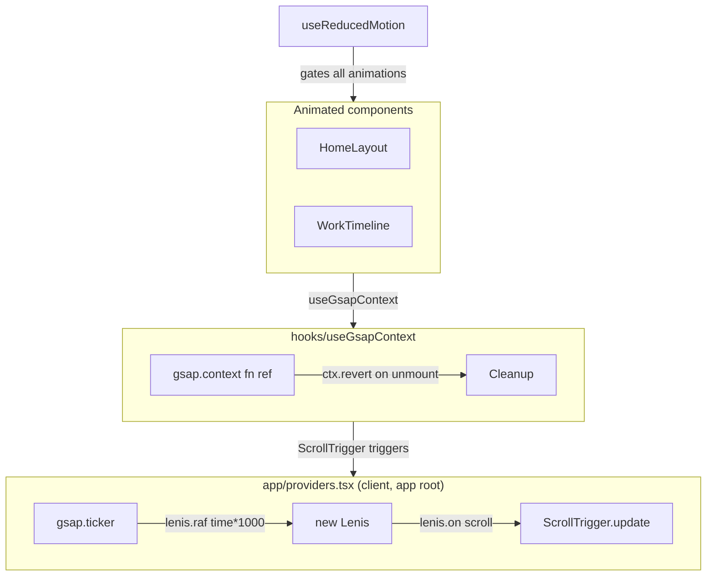

# Cuatro Porfolio

My Personal portfolio, deployed at [cuatro.dev](https://cuatro.dev). High-quality visuals, 3D interactive scenes, and scroll-driven storytelling. Fully self-hostable via Docker Compose.

- **Design:** [Figma](https://www.figma.com/design/g5PkF4kBfTuhY6ASeE5oMT/Cuatro-Portfolio?m=auto&t=9mx0OLX8cx7YJoKy-1)

## Tech Stack

| Layer         | Technology                                                |
| ------------- | --------------------------------------------------------- |
| Framework     | Next.js 16 (App Router, standalone output)                |
| UI            | React 19                                                  |
| Language      | TypeScript 5.9                                            |
| 3D / WebGL    | Three.js 0.183 + React Three Fiber v9 + @react-three/drei |
| Post FX       | @react-three/postprocessing (Bloom, chromatic aberration) |
| Animations    | GSAP 3.14 + ScrollTrigger                                 |
| Smooth Scroll | lenis                                                     |
| Styles        | Sass 1.97 (SCSS)                                          |
| Analytics     | Unami (self-hosted)                                       |
| Reverse Proxy | Caddy (auto-HTTPS)                                        |
| Testing       | Vitest + Playwright                                       |

## Local Development

```bash
pnpm install
pnpm dev        # http://localhost:3000
pnpm typecheck
pnpm build
```

## Docker

`docker-compose.yml` is the **production** stack for the Hostinger VPS and does not run
locally. It publishes no ports and joins `cs-tracker_default`, an external network owned by
another stack on that box, so `docker compose up` fails immediately anywhere else. That is
deliberate: the shared Caddy on the VPS is the sole ingress, and a second process binding 80
or 443 there is what took `cuatro.dev` down in August 2026. Use `pnpm dev` for local work.

To build the image alone, without the stack:

```bash
docker build -f docker/Dockerfile \
  --build-arg NEXT_PUBLIC_UMAMI_WEBSITE_ID=local \
  --build-arg NEXT_PUBLIC_UMAMI_URL=https://analytics.cuatro.dev \
  -t cuatro-portfolio-app .
docker run --rm -p 3000:3000 cuatro-portfolio-app   # http://localhost:3000
```

Both build args are required by the stack and are inlined at build time. Three-stage build:
deps to builder to runner (Node 22-slim)


```mermaid
flowchart LR
    A[deps<br/>node:22-slim<br/>pnpm install] --> B[builder<br/>node:22-slim<br/>pnpm build]
    B --> C[runner<br/>node:22-slim<br/>node server.js]
    B -- .next/standalone --> C
    B -- .next/static --> C
    B -- public/ --> C
```

## One-command deploy

```bash
docker compose --env-file .env.production up --build -d
```


```mermaid
graph LR
    Internet --> Caddy
    Caddy -->|cuatro.dev| App
    Caddy -->|analytics.cuatro.dev| Umami
    Umami --> Postgres
```

## Environment Varialbes

Copy `.env.example` and fill in values. Variables prefixed `NEXT_PUBLIC_` are inlined at build time.

| Variables                    | Description                    | Required |
| ---------------------------- | ------------------------------ | -------- |
| NEXT_PUBLIC_UMAMI_WEBSITE_ID | Umami site ID                  |          |
| NEXT_PUBLIC_UMAMI_URL        | <https://analytics.cuatro.dev> |          |

## Routing

| Route             | Description                                       |
| ----------------- | ------------------------------------------------- |
| `/`               | Home - GSAP layout + 3D gem                       |
| `/work`           | Experience Timeline                               |
| `/celeste`        | Standalone page, rendered with no header          |
| `/projects`       | 301 to `/#suite` (Story 2-14)                     |
| `/cv`             | CV: intro block plus the Experience Timeline (Story 2-16) |
| `/recommendation` | 308 to `/pdf/recommendation-letter.pdf`           |
| `/api/health`     | JSON health endpoint                              |
| Anything else     | `app/not-found.tsx`, 404                          |

Four corrections landed here with Story 2-15 (DW-60): the `recommendation-letter.pdf` filename was
spelled `remmendation-letter.pdf`, which is a path nothing serves, and `/celeste`, `/api/health`
and the 404 were all absent while the rendered-output suite sweeps them as real surfaces. The
served paths are `/pdf/...`; `public/` is the directory they are served from and is not part of
any URL.

`/cv` answered a 308 to `/pdf/cv.pdf` until 2026-09-10, which shadowed the route file behind it, so
the page had never rendered. Story 2-16 removed the redirect and built the page: it mounts the same
`WorkTimeline` `/work` does, above it an intro block, and it links `/pdf/cv.pdf`, which is still
served at its own URL for anyone holding it. `/work` goes on rendering the timeline standalone.

The header presents two of these routes, `/#suite` and `/cv`. **Every other route is reached only
by an inbound link or by typing it**: `SiteFooter` renders no destinations at all today, which
`components/organisms/SiteFooter/__tests__/SiteFooter.test.tsx:35-46` asserts three ways, and
Story 2-17 is what gives it the `/recommendation` and `/celeste` links the design assigns.

## Animation Architecture

Lenis owns the scroll position. GSAP owns the animation timeline. ScrollTrigger bridges them.


```mermaid
flowchart TD
    subgraph providers["app/providers.tsx (client, app root)"]
        L[new Lenis]
        T[gsap.ticker]
        L -->|lenis.on scroll| ST[ScrollTrigger.update]
        T -->|lenis.raf time*1000| L
    end

    subgraph hook["hooks/useGsapContext"]
        CTX[gsap.context fn ref]
        CTX -->|ctx.revert on unmount| CLEAN[Cleanup]
    end

    subgraph components["Animated components"]
        HL[HomeLayout]
        WT[WorkTimeline]
    end

    RM[useReducedMotion] -->|gates all animations| components
    components -->|useGsapContext| hook
    hook -->|ScrollTrigger triggers| providers
```
