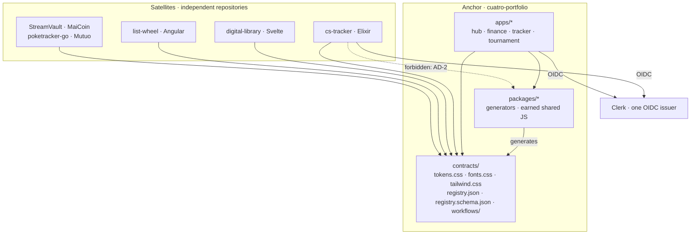
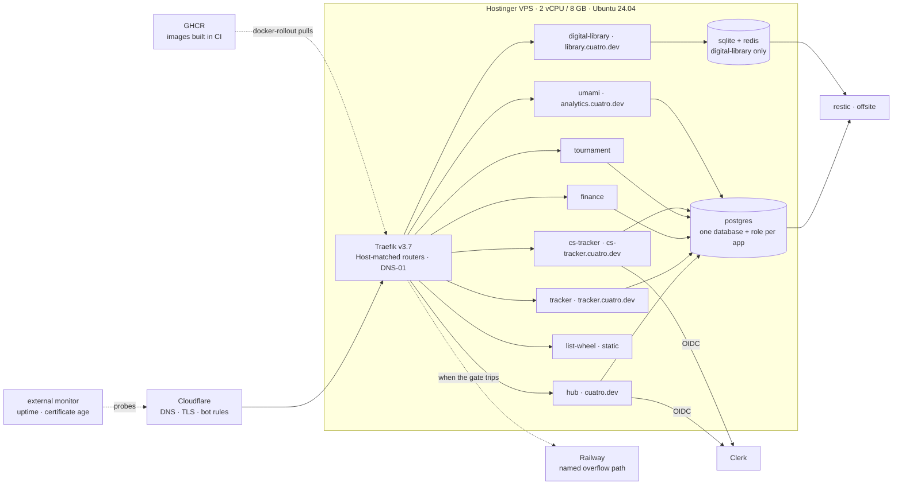
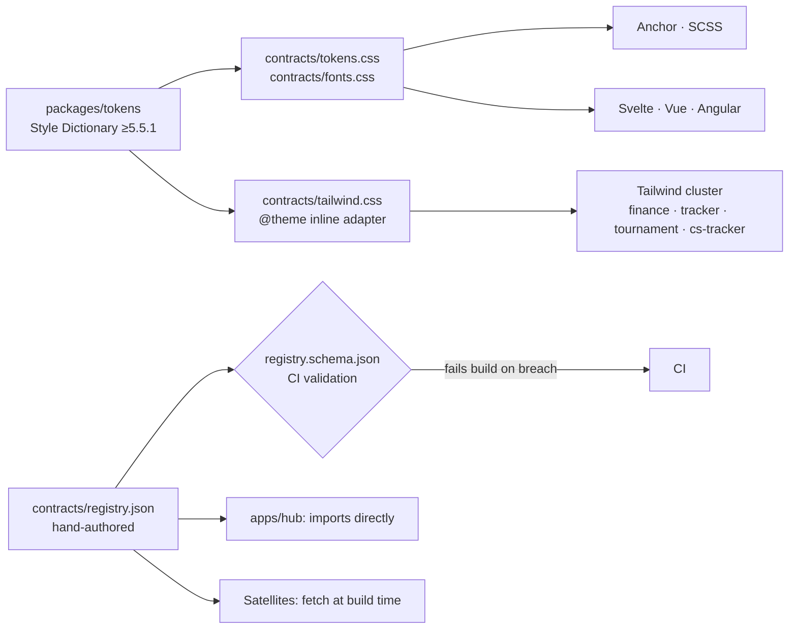

# Architecture Spine: Cuatro Ecosystem

## Design Paradigm

**Anchored Hub: contract-federated, shared-nothing satellites.**

Four layers, and the whole system is the rule about what may cross between them:

| Layer | Contents | May depend on |
| --- | --- | --- |
| **Contract** | `contracts/`: non-executable published text: CSS, JSON, JSON Schema, workflow YAML, woff2 | nothing |
| **Anchor** | `apps/*` (hub, finance, tracker, tournament) and `packages/*` (generators, earned shared JS) | Contract, and each other within `packages/*` |
| **Satellite** | seven independent repositories, each its own language, toolchain and deploy unit | Contract only |
| **Platform** | one VPS: Traefik, one Postgres, GHCR-sourced images, external monitoring | nothing in the layers above |

Nothing depends on a Satellite. No Satellite executes Anchor-authored code. A component library cannot span the six frameworks in this estate, so nothing tries: coherence is delivered by a *format* (tokens), a *protocol* (OIDC), a *document* (the Registry) and a *reference* (reusable workflows), each of which crosses every language boundary the estate contains.

## Invariants & Rules



### AD-1: The contract boundary is a directory, and CI holds it

- **Binds:** all
- **Prevents:** a Satellite acquiring a code dependency on the Anchor, the one dependency no framework boundary in this estate can carry
- **Rule:** A **contract** is an artifact a consumer in any estate language uses without executing Anchor-authored code. The entire published surface is `contracts/`, served at `https://cuatro.dev/contracts/`. CI fails if any file under `contracts/` matches `\.(ts|js|tsx|jsx|mjs|cjs)$`. Generators that *produce* contracts live in `packages/` and are never published. When tempted, the test is: can an Elixir consumer use this with nothing but a file read and a parser?

### AD-2: Code may be shared inside the Turborepo boundary, never across it

- **Binds:** `apps/*`, `packages/*`, all Satellites
- **Prevents:** both failure modes, a shared component library growing by accident, and four Next.js apps duplicating code because "nothing is shared"
- **Rule:** `apps/*` may depend on `packages/*`. No Satellite may depend on any `packages/*` artifact. Turborepo governs JS/TS only and is never asked to orchestrate Elixir, Go, Python or Solidity. A shared React package in `packages/*` is created only after real duplication has accumulated across two or more apps in the cluster, never in advance.

### AD-3: One application id, mechanically derived everywhere

- **Binds:** all
- **Prevents:** the Registry id, image name, compose service, database, router and OIDC client drifting into four different spellings of the same application
- **Rule:** Each application has exactly one id: lowercase kebab-case, equal to its repository name. Derived without exception, GHCR image `ghcr.io/luigiespinosa/<id>`, compose service `<id>`, Traefik router `<id>`, Postgres database and role `<id>` with hyphens as underscores, Clerk client `<id>`. The **public hostname is not derived**: three live hostnames already diverge from their ids, so the hostname is declared per entry in the Registry and the Registry is the only mapping.

### AD-4: The App Registry is authored JSON, validated by schema

- **Binds:** FR-5, FR-6, FR-9, FR-10, FR-11, FR-12, FR-13, FR-27, FR-32, FR-35
- **Prevents:** the Hub and the Satellites reading two different registries, and a malformed entry shipping
- **Rule:** `contracts/registry.json` is authored by hand and is the only Registry. `contracts/registry.schema.json` fixes the shape; the file carries `$schema` so the editor validates while writing, and CI validates and fails the build. The Hub imports `contracts/registry.json` directly, never a TypeScript copy. Satellites fetch `https://cuatro.dev/contracts/registry.json` at **build** time, never at request time, so no Satellite render spends Anchor CPU and no Satellite goes down when `cuatro.dev` does. The accepted consequence: a Registry change reaches a Satellite only on that Satellite's next rebuild, so a Satellite's Suite Switcher is stale until then. That is deliberate, instant propagation would mean either a runtime dependency on the Anchor or unattended rebuilds, and NFR-10 forbids the second in repositories without test suites. `content/projects.ts` is retired, not promoted.

### AD-5: The Registry entry shape

- **Binds:** FR-6, FR-19, FR-24, FR-27
- **Prevents:** consumers disagreeing about which fields they may rely on
- **Rule:** Required on every entry: `id`, `name`, `description`, `status`, `tech[]`, `source`, `demo`, `identity`. Optional: `live`, `family`, `absorbed_into`, `token_contract`. `demo` and `identity` are **required with an explicit value including `none`**: an absent field is never a permitted way to say "not applicable". `live` is required when `status` is `Live` and forbidden when `status` is `Archived`. `status` accepts exactly `Live`, `Complete`, `In progress`, `Archived`. The envelope carries `contract_version`; a value change is a minor bump, any field rename is major.

### AD-6: Registry membership is by application, not by repository

- **Binds:** FR-5, FR-30, Estate §5
- **Prevents:** absorbed and archived applications silently falling out of the Registry as the repository count drops to eight
- **Rule:** The Registry's unit is the **application**, not the repository. An application that has been archived or absorbed keeps its entry, with `absorbed_into` naming where its code now lives. Repository count and entry count are different numbers by design and neither validates the other.

### AD-7: Each application is one independent deploy unit, addressed by host

- **Binds:** all deployed applications, Epics 3 and 4
- **Prevents:** a monorepo collapsing into one deploy blast radius, a Hub change redeploying finance, and the shared-origin failure mode path routing produces
- **Rule:** One Dockerfile, one GHCR image, one compose service and one Traefik router per application id, including the four that live inside the Anchor. A deploy names exactly one id and Turborepo scopes the build to that workspace. Every router matches on `Host`; `PathPrefix` routing between applications is forbidden, a shared browser origin would put cookies, `localStorage` and XSS blast radius across every application in the suite.

### AD-8: Build in CI, push to GHCR; the box never compiles

- **Binds:** Epics 3 and 4, NFR-3
- **Prevents:** the estate's top unmeasured risk, compiling on a serving two-core box
- **Rule:** Images are built in GitHub Actions and pushed to GHCR tagged with the git sha. Deployment pulls a tag and runs `docker-rollout`; it never runs a build. For the four applications inside the Anchor the build context is the **repository root narrowed by `turbo prune --docker`**, with the Dockerfile at `apps/<id>/Dockerfile`: an app-directory context cannot see the lockfile or the workspace links and fails, and an unpruned root context ships the whole monorepo into every image. `docker-rollout` requires real healthchecks and services without `container_name` or published `ports`: both already true behind Traefik, and both are therefore requirements on every compose service. The current `deploy.yml`, which runs `docker compose up --build -d` over SSH, is retired in Epic 3 and is a standing violation of this rule until then.

### AD-9: The Capacity Gate blocks new placement mechanically, and defaults to blocked

- **Binds:** FR-33, NFR-3, SM-C4, Epics 1 and 4
- **Prevents:** an application being placed on unmeasured capacity by a judgement call at the moment the judgement is least reliable
- **Rule:** `ops/capacity-gate.yml` in the Anchor records `measured_at`, `baseline`, `threshold`, `reading`, `status`, `overflow` and a `placements` log. The deploy workflow reads it: placing a **new** id fails while `status: blocked`; existing ids always deploy, so NFR-2 is never traded against the gate. The gate measures the box's 15-minute load average. Per-container `cpu.pressure` (cgroup v2, Ubuntu 24.04) is the diagnostic that attributes pressure to one application rather than to the box. **Until Epic 1's measurement week writes a threshold, `status` is `blocked`**: unproven capacity fails closed. When the threshold trips, the response is the named overflow path (Railway, two heavy applications, $15–30/mo), never a Registry entry left pointing at something that does not resolve.

### AD-10: One Postgres, one database and role per consumer; other stores are declared and carry their own backup

- **Binds:** all data-owning applications
- **Prevents:** schema-per-app coupling migrations across applications, and an undeclared store going unbacked
- **Rule:** One Postgres container for the estate. One database and one role per application that uses Postgres; never schema-per-app. Each application sets an explicit `connection_limit` and the sum stays under `max_connections`; no PgBouncer, which solves serverless burst and not long-lived containers. An application using a different store declares it in `tech` and **carries its own offsite backup path**. `digital-library` (SQLite + Redis) is the declared exception today. Backups are `pg_dump` on cron plus restic offsite; a declared non-Postgres store without an equivalent offsite path is unbacked data, which is a defect.

### AD-11: Identity federates by protocol; sessions never leave their host

- **Binds:** FR-20, FR-21, FR-22, FR-23, Epic 5
- **Prevents:** a domain-scoped cookie, which forfeits `__Host-` hardening across every application and lets any one subdomain set a session its siblings accept
- **Rule:** OIDC Authorization Code + PKCE per application against one Clerk issuer. Each application mints its own host-only `__Host-` session; no `Domain=.cuatro.dev` cookie exists anywhere in the estate. No application contains provider-specific logic beyond issuer configuration and client credentials, OIDC *is* the reversibility seam. Logout is RP-Initiated plus Back-Channel, and `cs-tracker` additionally broadcasts on `live_socket_id` or an open LiveView socket never observes the logout. Traefik ForwardAuth is used only to gate surfaces with no authentication of their own, the Traefik dashboard and admin surfaces, and never as an application's identity path.

### AD-12: Identity participation is declared, never inferred

- **Binds:** FR-24, FR-27
- **Prevents:** a structurally exempt application reading as broken rather than as a design statement
- **Rule:** Every Registry entry carries `identity` with exactly one of `oidc`, `wallet`, `none`. `MaiCoin` is `wallet` and is structurally exempt, not unimplemented. Absence is not a permitted value.

### AD-13: Demo access is one contract, implemented per stack

- **Binds:** FR-25, FR-26, FR-27, FR-28, Epic 5
- **Prevents:** five stacks inventing five different reset semantics and five different isolation guarantees
- **Rule:** The demo principal is `demo@cuatro.dev` in every application, derived, not invented per stack, and owns every demo row. Each application exposes an idempotent `demo:reset` that deletes by owner and reseeds a baseline fixture committed in that application's own repository. Reset is scheduled **on the host, outside the application containers**: one scheduler for the estate, not an in-process scheduler per application, which would keep a timer alive in every container on a CPU-bound box. Hourly by default, per-application override permitted, and the interval is short enough that two Visitors arriving the same day both find a usable application. The demo principal cannot be deleted and its credentials cannot be changed from inside the application. Demo data and Operator data are never in the same ownership scope.

### AD-14: Token consumption route is a property of the consumer, and adoption is all-or-nothing

- **Binds:** FR-16, FR-17, FR-18, Epic 1 Step 2, Epics 2 and 6
- **Prevents:** a Phoenix application being handed a plain `:root` file that mints zero utility classes; and half-adopted Satellites, which look worse than unadopted ones
- **Rule:** `contracts/tokens.css` (values only, no `@font-face`), `contracts/fonts.css` (`@font-face` with `url()` relative to itself) and `contracts/tailwind.css` (generated `@theme inline` adapter that imports both) are versioned together and copied as a **folder named `cuatro-contracts/`**, never as individual files and never under another name, the fixed folder name is what makes AD-16's verification implementable across seven repositories with seven different stylesheet layouts. Tailwind consumers, `cuatro-finance`, `cuatro-tracker`, `cs-tournament` and **`cs-tracker`**: import `tailwind.css`. Non-Tailwind consumers import `tokens.css` and `fonts.css`. The Anchor is SCSS and consumes the plain pair. `--token-*` and Tailwind's `--color-*` are separate namespaces and never share a name on both sides of a `var()`. `inline` is mandatory on the `@theme` block. A Satellite adopts the whole contract or none of it. **Clarified 2026-08-15:** all-or-nothing binds the **contract import**, never the restyle. Read as "restyle wholly or not at all" this rule would contradict AD-20 outright, because a restyle is inherently incremental and AD-20 requires every step to leave a working system. A restyle proceeds component by component and reaches the Visitor as one merge; intermediate commits live on a branch and every blocking gate in AD-21 applies to them unchanged. In the Anchor, the step-2 alias layer is what keeps un-redesigned components coherent meanwhile, which is why that layer survives until the last redesign lands.

### AD-15: The Phoenix route carries both daisyUI paths

- **Binds:** Epic 1 Step 2, seam S-9, open item O-3
- **Prevents:** Epic 1's first visible ecosystem moment blocking on a question the public record cannot answer
- **Rule:** `cs-tracker` maps daisyUI's variables onto the token roles through `@plugin "daisyui/theme" { --color-primary: var(--token-accent); }` if a scratch `mix phx.new` confirms `var()` is accepted there, and through `[data-theme="…"] { --color-primary: var(--token-accent); }` if it is not. The test is a gate on the step, not on the contract; both paths produce the same rendered result and either satisfies FR-18.

### AD-16: Contract changes are versioned, and adoption is explicit and recorded

- **Binds:** FR-19, NFR-10
- **Prevents:** a colour change shipping as a minor bump into an unattended merge, in repositories with no test suite and no users to notice the layout break
- **Rule:** A value change is a minor bump; any rename is major, including fixing a typo in a token name. With no atomic commits across eight repositories the only model is deprecate → migrate → remove. Adoption in a Satellite is an explicit reviewed commit. No unattended dependency automation is enabled in any repository lacking a real test suite. Each Satellite's adopted version is declared in its Registry entry's `token_contract` and **verified** against the `Contract vX.Y.Z` header in its vendored `cuatro-contracts/tokens.css` by the same scheduled job that checks links, so the declaration cannot drift from reality in silence. The verification depends on AD-14's fixed folder name; a Satellite that renames the folder breaks the check rather than the styling, which is why the name is a rule and not a suggestion.

### AD-17: Three prerequisite gates, each a blocking predecessor

- **Binds:** Epics 1 and 2, NFR-7, NFR-10, FR-31, FR-33
- **Prevents:** automating in an estate with no error signal, and shipping a crawler amplifier onto unmeasured capacity
- **Rule:** (a) External uptime and certificate-**age** monitoring exists before any automation is enabled anywhere in the Ecosystem. Age, not expiry, the window between a silently broken renewal and a dead site halves in Feb 2027 and again in Feb 2028. (b) Bot mitigation is live on every live subdomain before the Suite Directory ships. (c) The Capacity Gate carries a written threshold before any new id is placed. Each is a blocking predecessor of the work it guards, never a parallel task.

### AD-18: The Registry is verified against reality on a schedule, from off the box

- **Binds:** FR-28, FR-32, SM-4, SM-5
- **Prevents:** the Registry asserting something that stopped being true, in an estate with no user to discover it
- **Rule:** One scheduled job checks, for every entry: `source` resolves; `live` resolves whenever `status` is `Live`; the Satellite's vendored token version matches `token_contract`. Any failure notifies the Operator. The job runs external to the VPS, so a whole-box failure still produces a notification. When an application cannot be kept running, its `status` moves off `Live` and its `live` URL is removed in the same change, the Registry never presents a URL that does not resolve.

### AD-19: The accessibility floor is asserted, not claimed

- **Binds:** NFR-5, NFR-6, open items O-8 and O-9
- **Prevents:** the exact failure the UX validation named, a document asserting a property it does not implement
- **Rule:** Playwright runs in CI against the Hub at a 360px viewport, asserting two things. (a) Every interactive element's `boundingBox()` measures at least 44×44. (b) The Status mark's **three structural axes** hold, per `EXPERIENCE.md` § Status mark, which is the single source for the mapping: `Live` carries a 4px dot that `Complete` lacks; `Complete` is solid where `In progress` is dashed; `In progress` has a border that `Archived` drops. Asserting `border-style` alone is forbidden, `Live` and `Complete` are both `1px solid` and are 1.13:1 apart in greyscale without the dot, so a border-only assertion passes a broken implementation and fails a correct one. Lighthouse CI's existing accessibility assertion (≥0.95, severity error) stays and is not weakened. **Amended 2026-08-15:** after restyle, **every restyled application** is measured once by hand against the same floor and the result recorded, not `cs-tracker` alone. That is three manual passes in Epic 8 wave 1 and two more in wave 2. The cost is real and is not avoidable: a restyle can lower contrast, break a focus ring or shrink a hit target in ways no CI job running against the Anchor can see. Opacity is never used to express state, anywhere.

### AD-20: Every step leaves a working system, and the Epic 3 order is fixed

- **Binds:** NFR-2, Epic 3
- **Prevents:** a path rewrite and a history merge failing together, with no way to tell which one broke the live flagship
- **Rule:** `cuatro.dev`, `cs-tracker.cuatro.dev`, `tracker.cuatro.dev` and `library.cuatro.dev` serve through every step of every epic. In Epic 3 the Hub moves to `apps/hub` as its **own shipped step with nothing else changing**: rewriting `ci.yml`, `lighthouse.yml`, `deploy.yml`, `docker/Dockerfile`, `tsconfig.json` and `vitest.config.ts` and nothing more. Then `cuatro-finance`, then `cuatro-tracker`, then `cs-tournament`, one shipped and verified step each. Each merge runs `git filter-repo --to-subdirectory-filter apps/<id>` on a scratch clone of the source, then `git merge --allow-unrelated-histories`, so `git log --follow` works from the new path afterwards.

### AD-21: One environment; CI is the only pre-production gate

- **Binds:** all
- **Prevents:** CI checks being treated as advisory because something downstream will catch it
- **Rule:** There is production and there is a developer's machine. No staging environment exists and none is introduced, NFR-1 and NFR-3 both refuse it. Consequently every CI gate is blocking and none may be made a warning: typecheck, unit tests, Registry schema validation, `contracts/` purity (AD-1), the Playwright floor (AD-19), Lighthouse accessibility, and the FR-17 colour-literal conformance check (added 2026-08-15, replacing the one-time sweep the restyle programme made obsolete).

### AD-22: Settled inputs have a shelf life, and the re-check is bounded

- **Binds:** Epics 4, 5, 6, 7
- **Prevents:** acting on a stale version pin or a stale price as though it had been verified
- **Rule:** An epic whose first story opens after **2026-11-15** records a refresh check before that story opens. The scope of the check is fixed: Traefik, PostgreSQL, restic and `docker-rollout` versions; Clerk and Railway pricing; the Style Dictionary ≥5.5.1 security floor; and the Let's Encrypt lifetime schedule (90 → 64 days in Feb 2027 → 45 days in Feb 2028). Nothing outside that list re-opens, and a decision is never re-litigated because time passed.

### AD-23: Migrations are a discrete step and must survive the rollout overlap

- **Binds:** every application owning a schema, Epics 3, 4, 5
- **Prevents:** a destructive migration breaking live requests while the previous version is still serving, `docker-rollout` is scale-then-drain, so old and new containers overlap by construction
- **Rule:** Schema migrations never run on container boot. They run as a discrete step against the application's own database, before the rollout starts, and each migration must be backward-compatible with the version still serving, expand first, contract in a later release, never both in one. An application whose framework defaults to migrate-on-boot disables that default explicitly.

### AD-24: Restyle is native; the component vocabulary federates as a specification, never as code

- **Binds:** FR-36, FR-37, FR-38, Epic 8, all Satellites and all `apps/*`
- **Prevents:** the restyle programme producing exactly the shared component library AD-2 and PRD §8 rule out. This is the first configuration of the estate in which that argument has a real premise rather than a hypothetical one: the same nine components get implemented in HEEx, Svelte, Angular, React and Vue. The evidence has not changed (Google defunded Material Web in 2024-06, GitHub retired Primer ViewComponents in 2026-02, Adobe maintains parallel implementations with no consolidation plan) and no library spans these five frameworks. But the decision now needs a defence rather than a restatement, and this is it.
- **Rule:** Each application implements the component vocabulary in its own framework, from the written **Restyle Specification**. No Satellite imports a component, a class-name library, a stylesheet other than its vendored `cuatro-contracts/` folder, or any `packages/*` artifact from the Anchor. The same component recurring across three or more applications is evidence that the *specification* should be better, never that a *package* should exist. AD-1's CI purity check is unchanged and still holds the boundary. If a plan implies shared component code crossing the Turborepo boundary, the plan is mis-scoped, not the rule. **The Restyle Specification is a required deliverable, not documentation polish:** without it, five hand-written implementations drift and the pressure to extract a package becomes the path of least resistance.

### AD-25: A restyle exists only for an application the Suite Directory renders

- **Binds:** FR-38, Epic 8, SM-C6, PRD §9.2
- **Prevents:** the Operator, who is the estate's scarcest resource, being spent on surfaces no Visitor reaches
- **Rule:** An application earns a restyle when its Registry `status` becomes `Live` or `Complete` and it therefore passes FR-35's filter. The gate is that same declarative rule; no second list is maintained and no judgement call is made at the moment judgement is least reliable, which is the pattern AD-9 already establishes for capacity. A restyle work item for an unrendered application is a defect. Archiving an unbuilt application is a legitimate and permanent way to close its restyle obligation.

## Consistency Conventions

| Concern | Convention |
| --- | --- |
| Application identity | One kebab-case id per application, equal to the repository name (AD-3). Postgres identifiers substitute underscores for hyphens. Hostnames are declared in the Registry, never derived. |
| Files & directories | `apps/<id>/`, `packages/<name>/`, `contracts/`. Anchor components stay atoms / molecules / organisms as they are today. |
| Contract artifacts | Lowercase, extension-typed, no version in the filename: the version lives in the file's own header and in `contract_version`. |
| Registry data | `status` is one of four exact strings. `tech[]` reflects what the application runs on today; a wrong value is a defect, not a cosmetic issue. `description` is one to three sentences, reader-facing, no marketing adjectives, no first person. |
| Dates & versions | ISO 8601, UTC. Semver on every contract: value change minor, rename major. |
| Images & deploys | `ghcr.io/luigiespinosa/<id>:<git-sha>`. A deploy names one id. No estate application ever runs a floating tag; third-party infrastructure images are pinned to a major at minimum. Umami's `postgresql-latest` is the one inherited floating tag and is pinned during Epic 4. |
| Measurement | First-party and self-hosted only. No third-party analytics, tag manager, session recorder or tracking script is introduced in any application in the estate, Anchor or Satellite (NFR-8). Hub events are Umami custom events, distinguishable per SM-1 through SM-3. |
| Recurring cost | All-in spend stays inside $40–100/month, and the VPS is sunk to 2028 so only marginal spend counts (NFR-4). Any new recurring charge (identity, monitoring, overflow hosting) is a named decision recorded against that ceiling, never an incidental subscription. |
| State & mutation | Each application owns its own data and its own store; no application reads another's database. The Registry is the only shared document, is read-only to every consumer, and is written only in the Anchor. |
| Auth | Per-application `__Host-` session, never a domain-scoped cookie. Issuer configuration and client credentials are the only provider-specific values an application may contain. |
| Config & secrets | Environment variables only; `.env.example` documents every required variable; secrets live in GitHub Actions secrets and the on-box env file and never in the repository. |
| Errors & failure | A failing gate fails the build or the deploy, never logs and continues. A capacity gate with no measurement is `blocked`, not `open`. |
| Styling | Consume the semantic `--token-*` roles, never the raw `--c-*` palette. `color-scheme: dark` on `:root` in every consumer. Nine hand-fix lines per Satellite, in the order given in the UX seams inventory. That is Token Adoption, and it is the floor. A rendered application goes further and is restyled natively against the Restyle Specification (AD-24, AD-25). No colour, spacing or type literal outside `contracts/` and the print stylesheet, enforced by a blocking CI check. |

## Stack

Verified 2026-08-15. The code owns these once it exists; AD-22 governs when they are re-checked.

| Name | Version |
| --- | --- |
| Ubuntu (VPS) | 24.04 LTS |
| Traefik | v3.7.10 |
| PostgreSQL | 18.6 (19 GA expected Sept 2026; greenfield target chosen at Epic 4 under AD-22) |
| restic | 0.19.1 |
| docker-rollout | v0.14 |
| Node.js | 24 LTS (22 is maintenance-only since 2025-10-21; Node 26 becomes LTS 2026-10-28, decided under AD-22) |
| pnpm | 10.31.0 |
| Turborepo | 2.10.x |
| Next.js | 16.1.6 |
| React | 19.2.4 |
| Sass (Anchor) | 1.97.3 |
| Three.js / R3F / drei | 0.183.2 / 9.5.0 / 10.7.7 |
| GSAP + ScrollTrigger / lenis | 3.14.2 / 1.3.18 |
| Vitest | 4.0.18 |
| @playwright/test | 1.62.1 |
| Style Dictionary | ≥ 5.5.1 (security floor) |
| DTCG format module | 2025.10 |
| Tailwind CSS (cluster + Phoenix) | v4 |
| Phoenix (`cs-tracker`) | ~> 1.8.7 |
| oidcc (Elixir client) | 3.8.0 |
| Clerk | managed, unversioned |
| Umami | `postgresql-latest` (inherited floating tag; pinned at Epic 4) |

## Structural Seed

### The Anchor

```text
cuatro-portfolio/                  # the Anchor: the Hub, and the publisher of contracts
  apps/
    hub/                           # cuatro.dev: Next.js, SCSS, the Three.js narrative
      Dockerfile
    finance/                       # merged in Epic 3: Next.js + Prisma + Tailwind
    tracker/                       # merged in Epic 3: tracker.cuatro.dev
    tournament/                    # merged in Epic 3, plus a separate Go worker service
  packages/
    tokens/                        # Style Dictionary source + build. NEVER published.
    registry/                      # schema tooling and validation. NEVER published.
  contracts/                       # THE PUBLISHED SURFACE: no executable code, CI-enforced
    tokens.css  fonts.css  tailwind.css
    fonts/                         # woff2, latin subset only
    registry.json  registry.schema.json
    workflows/                     # reusable CI workflow definitions
  ops/
    capacity-gate.yml              # AD-9: read by the deploy workflow
  .github/workflows/
  turbo.json  pnpm-workspace.yaml
```

### Deployment topology



### Contract publication and consumption



## Capability → Architecture Map

| Capability / Area | Lives in | Governed by |
| --- | --- | --- |
| Epic 1 · archive three shells (Estate 15→12) | GitHub repository settings | AD-6 |
| Epic 1 · uptime + certificate-age monitoring | external service | AD-17a, AD-18 |
| Epic 1 · bot mitigation on four subdomains | Cloudflare | AD-17b |
| Epic 1 · capacity measurement week + written threshold | `ops/capacity-gate.yml` | AD-9, AD-17c |
| Epic 1 · token contract published | `packages/tokens` → `contracts/` | AD-1, AD-14, AD-16 |
| Epic 1 · Anchor token adoption (FR-17, FR-18) | `apps/hub` SCSS, steps 1–2 of the UX migration | AD-14, AD-19 |
| Epic 1 · `cs-tracker` token adoption (FR-18) | Satellite repository, vendored folder | AD-14, AD-15 |
| Epic 2 · App Registry as product (FR-5–FR-12, FR-35) | `contracts/registry.json` + schema | AD-4, AD-5, AD-6 |
| Epic 2 · Suite Directory + front door (FR-1–FR-4) | `apps/hub` | AD-19, AD-21 |
| Epic 2 · link verification (FR-32) + Hub analytics (FR-34) | scheduled job; Umami | AD-18 |
| Epic 2 · `list-wheel` relocation (§5.3) | Satellite; static site behind Traefik | AD-3, AD-7, AD-9 |
| Epic 2 · Hub components rebuilt token-native (FR-37) | `components/*` SCSS, replacing migration steps 3, 4, 6, 7 | AD-14, AD-19, AD-21, AD-24 |
| Epic 2 · FR-17 colour-literal conformance gate | `.github/workflows/ci.yml` | AD-21 |
| Epic 8 · wave 1 restyle (`cs-tracker`, `digital-library`, `list-wheel`) | Satellite repositories, natively | AD-14, AD-19, AD-20, AD-24, AD-25 |
| Epic 8 · wave 2 restyle (`cuatro-tracker`, `cs-tournament`) | `apps/*` after the Epic 3 merges | AD-14, AD-19, AD-20, AD-24, AD-25 |
| Epic 3 · Hub move, then three merges | `apps/*` | AD-2, AD-20 |
| Epic 3 · build in CI, push to GHCR | `.github/workflows` → `contracts/workflows` | AD-7, AD-8 |
| Epic 4 · greenfield VPS rebuild | Traefik, one Postgres, `docker-rollout` | AD-7, AD-8, AD-10, AD-20, AD-22, AD-23 |
| Epic 5 · identity (FR-20–FR-24) | Clerk + per-app OIDC client | AD-11, AD-12 |
| Epic 5 · Demo Access (FR-25–FR-28) | per-application `demo:reset` + baseline fixture | AD-13, AD-18, AD-23 |
| Epic 6 · token distribution machinery (FR-19) | deferred; shape fixed | AD-16 |
| Epic 7 · WSL2 relocation | developer machine only |: (no ecosystem invariant) |

## Contradictions and Forced Changes

Surfaced rather than smoothed over, as the architecture prompt asked.

**C-1: The FR-9 defect is narrower than recorded.** The UX validation report and the architecture prompt both state that `digital-library` "runs on SQLite, not Postgres: the Registry entry is wrong." The committed [`content/projects.ts`](../../../../content/projects.ts) **already lists `SQLite`** correctly. The only stale value is `Hetzner VPS`, which is exactly what PRD FR-9's own consequence line says. The broader claim came from an earlier draft in the UX run and should not propagate into the epic breakdown.

**C-2: The one-Postgres topology does not reach `digital-library`, and neither does the backup design.** Confirmed by C-1: `digital-library` is SQLite + Redis. The topology rule survives with a declared exemption (AD-10). The consequence nobody has yet stated is that `pg_dump` + restic covers no `digital-library` data, a live application whose store has no backup path in any input document. AD-10 makes the exemption carry its own offsite path.

**C-3: FR-5 and §5 contradict each other on what the Registry contains.** FR-5 requires an entry for archived and absorbed applications *and* says "no Registry Entry exists for an application not in the Estate", while §5 defines the Estate as eight repositories, which excludes the archived and absorbed ones. Resolved by AD-6: the Registry's unit is the application, not the repository, and the two counts are deliberately different. **This forces a rewording of FR-5's third consequence bullet.**

**C-4: FR-6 and FR-27 disagree on whether `demo` is optional.** FR-6 lists `demo` as optional; FR-27 requires every entry to carry one. Resolved by AD-5: `demo` is required with an explicit value that includes `none`. **This forces a change to FR-6's field list.** The same resolution applies to the new `identity` field.

**C-5: Architecture adds two fields to the FR-6 contract.** `identity` (AD-12, satisfying FR-24 mechanically rather than in prose) and `token_contract` (AD-16, satisfying FR-19's "the Operator can determine which Satellites are on which version"). **Both are forced changes to FR-6.**

**C-6: The Registry's source of truth changes type.** Addendum §C.1 frames the Registry as "a promotion of an existing structure, not a green-field build", assuming `content/projects.ts` survives. AD-4 retires the TypeScript file in favour of authored JSON, because a TypeScript module cannot satisfy FR-12 for an Elixir or Go consumer and an emitted copy would give the Hub a second representation to drift from. The *shape* is still a promotion of the existing one; the file is not.

**C-7: Addendum §C.2 overstates the installed test harness.** It records the Anchor as "Vitest + Playwright". `@playwright/test` appears only as a transitive entry in `pnpm-lock.yaml`, not in `package.json`. AD-19 therefore *adds* Playwright rather than extending it, which is a real cost in Epic 2 rather than a free one.

**C-8: The box compiles today, in violation of a settled decision.** [`deploy.yml`](../../../../.github/workflows/deploy.yml) runs `docker compose up --build -d` over SSH on the VPS, and its step is still named "Deploy to Hetzner". Research names building on a serving two-core box as the top unmeasured risk. This is not a contradiction between documents but between every document and the running system, and AD-8 marks it a standing violation until Epic 3.

**C-9: The deployed routing table exists nowhere in source.** [`docker/Caddyfile`](../../../../docker/Caddyfile) routes only `cuatro.dev` and `analytics.cuatro.dev` while its compose file binds `:80`/`:443`. How `cs-tracker.cuatro.dev`, `tracker.cuatro.dev` and `library.cuatro.dev` reach the box is unknown to the Operator. Epic 4 is a greenfield rebuild that must preserve four live subdomains it cannot currently enumerate from source, so enumerating them on the box is a prerequisite of that epic, not a task inside it.

**C-10: The `In progress` four are in the Registry but not in the identity or demo scope.** `StreamVault`, `MaiCoin`, `poketracker-go` and `Mutuo` hold entries (FR-5) and are unrendered (FR-35), but AD-12 and AD-13 require `identity` and `demo` values on every entry. Their values are `none` / `not-deployed` until they are built: declared, not blank. This is a consequence of AD-5, not a conflict.

**C-11. AD-14's "all-or-nothing" cannot carry two meanings.** Added by the restyle scope change of 2026-08-15. The phrase was written about the *contract files*: import all three or none, because a half-imported contract mints half a system. Read as "restyle wholly or not at all" it contradicts AD-20 outright, since a restyle is inherently incremental while AD-20 requires every step to leave a working system. **Resolved in AD-14 itself:** all-or-nothing binds the import, the restyle ships as one merge off a branch, and the Anchor's step-2 alias layer is what holds the intermediate state together. **This is why Story 1.18's alias layer survives the collapse of the seven-step migration.**

**C-12. AD-2 survives the restyle programme, but it stops being self-evident.** Under token-only adoption there was never a reason to share components, because nothing was being built twice. Under a restyle programme the same nine components are implemented five times in five languages. That is genuine duplication and it is the first configuration of this estate in which the shared-library argument has a real premise. **Not a contradiction, and not resolved by restating AD-2.** AD-24 carries the defence, and it makes the Restyle Specification a required deliverable: the vocabulary has to federate as *something*, and a written specification is the only form that crosses HEEx, Svelte, Angular, React and Vue. Recorded here rather than smoothed over because if any decision in this spine breaks later, this is the one.

**C-13. FR-18 must not be raised to mean "restyled".** The temptation is obvious now that "reads as one product" is the goal. Doing it would make Epic 1 depend on Epic 8, which depends on Epic 2, and the foundation epic would stop delivering visible value on its own, putting PRD §14's highest-severity risk (the Operator abandoning mid-migration) back on the table for no gain. FR-18 stays as written and stays satisfied by Token Adoption alone; the stronger claim is measured by FR-36 and SM-12. This separation is load-bearing.

## Deferred

- **Token distribution machinery**: npm package, Renovate shareable preset, published reusable workflows. The published *shape* is fixed by AD-14 and AD-16 so nothing blocks later; the machinery is earned by three hand-copied token changes actually performed, not scheduled.
- **A shared React package for the Next.js cluster**: earned by real duplication accumulating across two or more `apps/*` after the Epic 3 merges (AD-2).
- **Point-in-time database recovery**: earned by a loss window `pg_dump` frequency cannot cover.
- **A light theme**: the contract is dark-only. Seam S-7 is accepted deliberately; a Satellite adopts fully or not at all.
- **Cross-framework conventions for form validation, overlays and dense data UI**: seams S-4, S-5 and S-6 are accepted, permanently. This is the token ceiling and the spine does not pretend to dissolve it.
- **The Suite Switcher's implementation**: v2. The pattern plus the data contract is all that federates (AD-4); each Satellite renders it natively.
- **Authorization**: roles, permissions and organisations. Authentication only.
- **The greenfield PostgreSQL major**: 18 today, 19 GA in Sept 2026, decided at Epic 4 under AD-22.
- **Whether the four `In progress` applications are ever built**: an Operator decision outside every document here, and archiving them is a legitimate outcome. Under AD-25 they are also never restyled while unrendered, so this deferral now costs nothing in either direction.
- **The `--token-scrim` role and the disposition of the three O-12 surfaces:** GlitchText's aberration, ScanlineOverlay's darkening layer, the decorative numeral. Decided in the UX restyle pass, not here. The spine records only that a darkening layer surviving redesign needs a named role, because "nothing is pure" bars `#000` regardless of how the component is rebuilt, and that a role addition is a minor bump under AD-16 forcing no consumer to migrate.
- **The Restyle Specification's contents.** AD-24 requires the artifact and fixes its job; what the component vocabulary *is* belongs to UX.
- **Hostnames for `cs-tournament` and `list-wheel`**: `wheel.cuatro.dev` is a placeholder in the UX mocks (O-5); the Registry is the only mapping (AD-3) and it is written when the hostname is chosen.
- **WSL2 relocation mechanics**: Epic 7, developer machine only, no ecosystem invariant depends on it.
- **Per-App Layer feature work**: out of scope by PRD §8, in every application.
